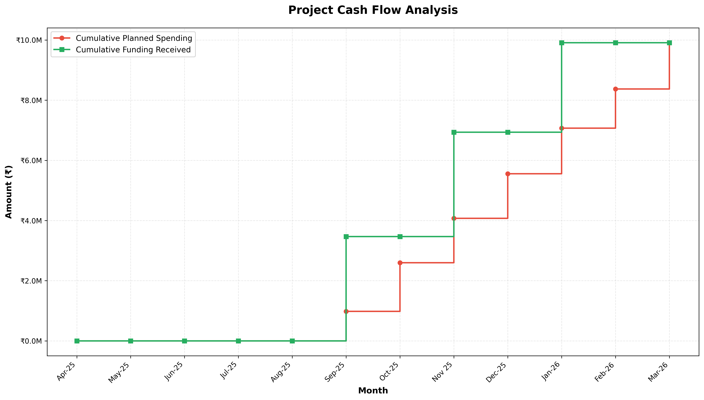
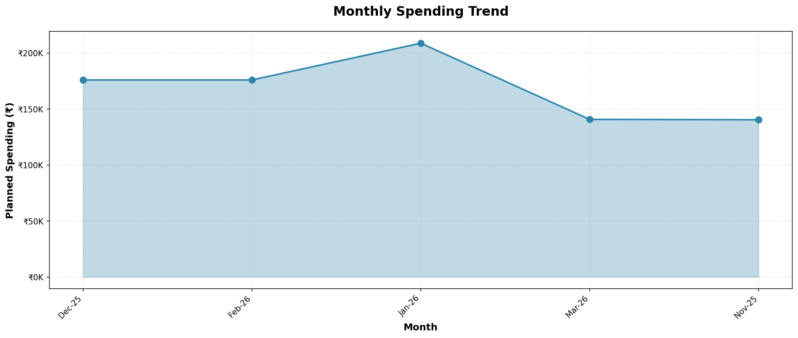
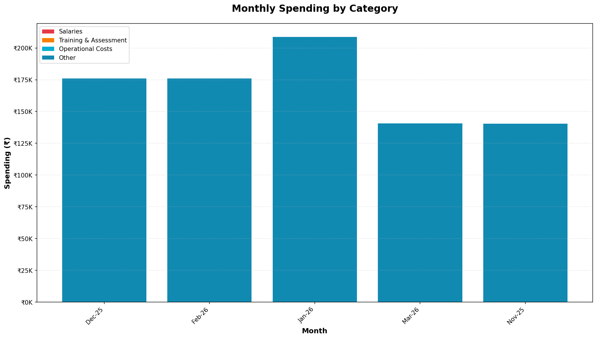
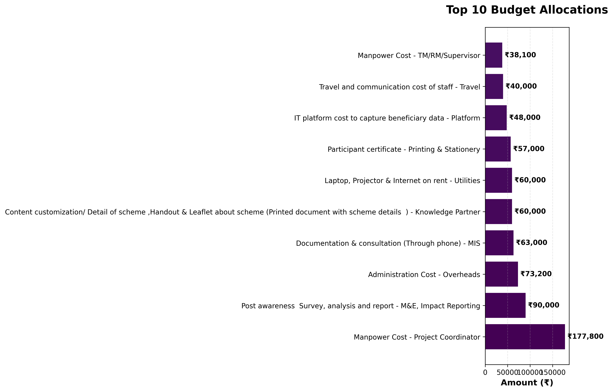
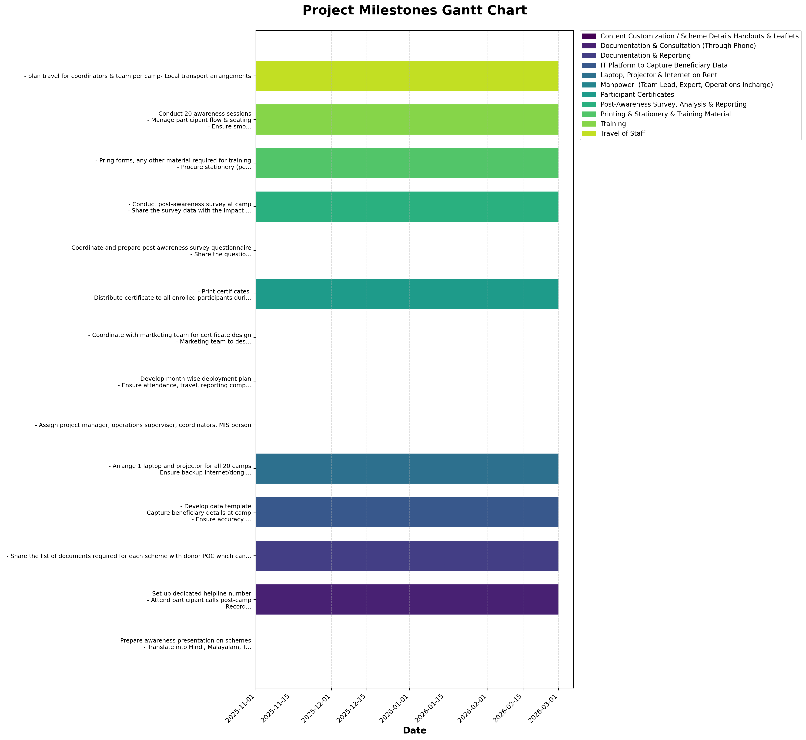
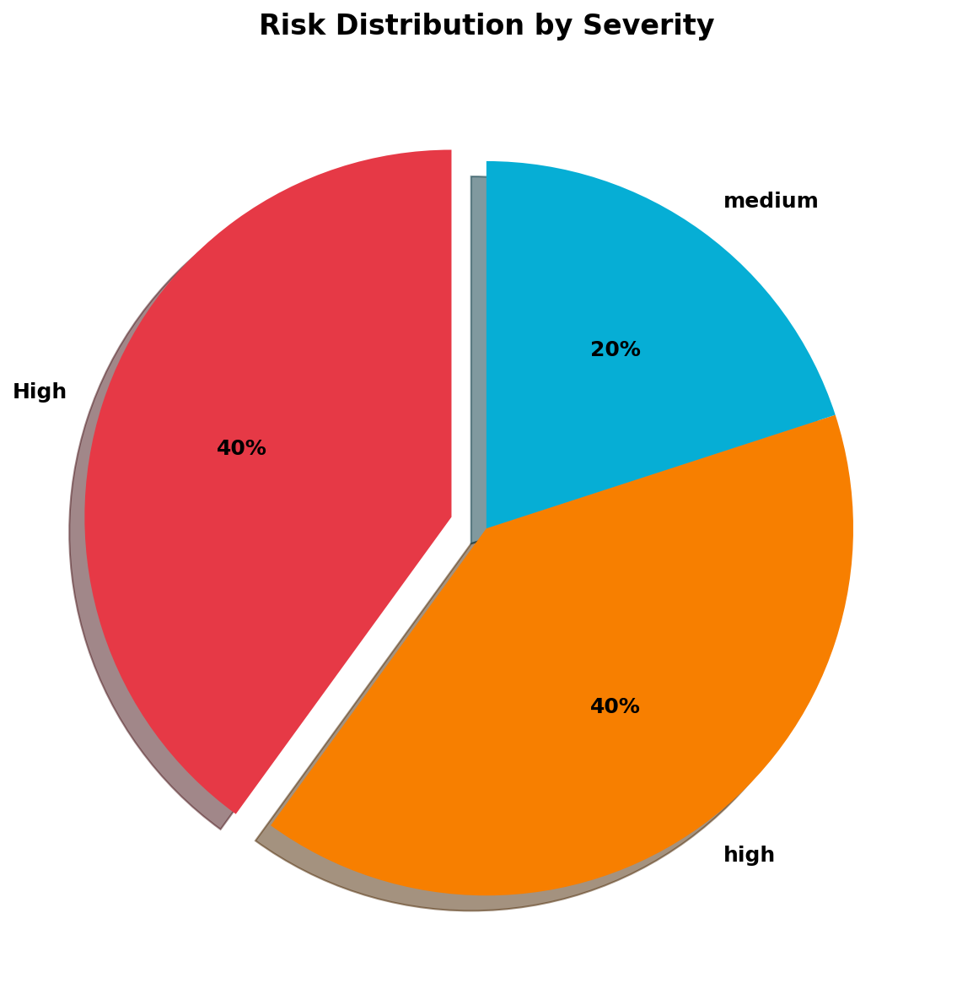
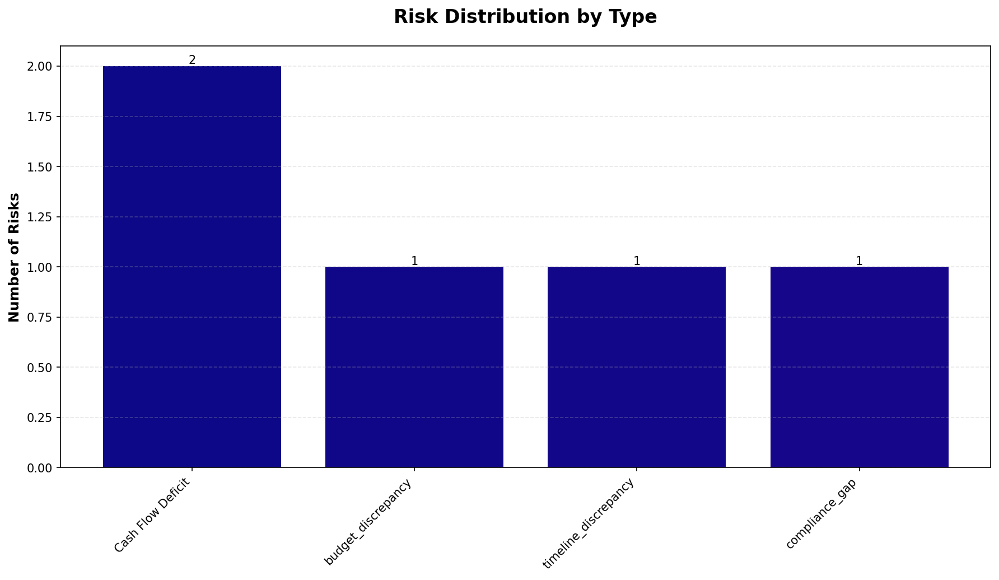

# Project Risk & Health Report

**Generated:** November 25, 2025 at 03:43 PM

---

## Project Overview

**Skilling Program for Youth in IT-ITeS Sector**

A college-cum-community-based training program for 1,980 underserved youth in Hyderabad, Mumbai, and Bangalore. The program will be implemented through 9 colleges and 3 Express Training Centres (ETCs), delivering training in AI Productivity & Applications, followed by certification and placement support.

| **Field** | **Details** |
|-----------|-------------|
| **Funder** | Ivanti Technology India Pvt. Ltd. |
| **Implementing Entity** | Sambhav Foundation |
| **Deployment Region** | Mumbai, Bangalore & Hyderabad |
| **Project Period** | 1st September 2025 to 31st March 2026 |
| **Total Budget** | ₹9,908,303.60 |
| **Duration** | 14 months |

## Executive Dashboard

### Key Metrics at a Glance

| **Metric** | **Value** |
|------------|----------|
| Total Project Value | ₹9,908,303.60 |
| Project Duration | 14 months |
| Average Monthly Burn Rate | ₹707,735.97 |
| Highest Cost Item | Manpower Cost - Project Coordinator (₹177,800) |
| **Total Risks Identified** | **5** |
| High Severity Risks | 4 |
| Medium Severity Risks | 1 |

---

## Financial Health Analysis

### Cash Flow Analysis

The cash flow graph below shows the cumulative funding availability versus planned spending:

### Monthly Cash Flow Details

| **Month** | **Monthly Spend** | **Cumulative Spend** | **Cumulative Funding** | **Cash Available** |
|-----------|------------------:|---------------------:|-----------------------:|-------------------:|
| Dec-25 | ₹175,950 | ₹175,950 | ₹0 | ⚠️ ₹-175,950 |
| Feb-26 | ₹175,950 | ₹351,900 | ₹0 | ⚠️ ₹-351,900 |
| Jan-26 | ₹208,725 | ₹560,625 | ₹2,972,491 | ✅ ₹2,411,866 |
| Mar-26 | ₹140,760 | ₹701,385 | ₹2,972,491 | ✅ ₹2,271,106 |
| Nov-25 | ₹140,415 | ₹841,800 | ₹6,440,398 | ✅ ₹5,598,598 |

### Monthly Spending Pattern

### Budget Allocation by Category

### Top Budget Line Items

## Project Timeline & Milestones

The Gantt chart below illustrates major activities and their timelines:

## Risk Register

### Risk Distribution Overview

<table>
<tr>
<td width="50%">

</td>
<td width="50%">

</td>
</tr>
</table>

---

### Detailed Risk Analysis

| **Risk Type** | **Severity** | **Details** |
|---------------|--------------|-------------|
| Cash Flow Deficit | High | **Month:** Dec-25 Planned spending (₹175,950.00) exceeds available funding (₹0.00) by ₹175,950.00 |
| Cash Flow Deficit | High | **Month:** Feb-26 Planned spending (₹351,900.00) exceeds available funding (₹0.00) by ₹351,900.00 |
| budget_discrepancy | high | The project plan states that 1,980 candidates will be trained across 9 colleges and 3 ETCs, with 480 candidates trained in colleges and 180 in ETCs per location. However, the budget allocations show a total manpower cost of ₹253,000 (Project Coordinator: ₹177,800 + TM/RM/Supervisor: ₹38,100 + Project Manager: ₹38,100) for a project that requires training 1,980 candidates. This suggests a severe underfunding for human resources, as the budget does not account for the scale of the project. The project coordinator's budget is ₹177,800 for a project that requires managing 1,980 candidates across multiple locations and institutions, which is insufficient for the scale of the project. |
| timeline_discrepancy | medium | The project timeline spans from September 2025 to March 2026 (approximately 6 months). However, the budget allocations do not specify any timeline for the implementation of key activities such as training delivery, assessment, certification, and placements. The project requires 50% placements post-certification (990 candidates), but the budget does not account for the time needed to achieve this, which could be a significant challenge given the short timeline. |
| compliance_gap | high | The project plan includes continuous monitoring and evaluation (M&E) and post-placement tracking for 3 months. However, the budget allocations for M&E and Impact Reporting are only ₹90,000, which is insufficient to cover the costs of continuous monitoring for 1,980 candidates over 3 months. Additionally, the project requires a final program report with outcomes and learnings, but the budget does not include sufficient funds for comprehensive data analysis and reporting, which could lead to non-compliance with the project's own monitoring and evaluation requirements. |

## Strategic AI Analysis

AI-powered strategic risk audit identified the following high-level concerns:

*No strategic risks identified in this analysis.*

---

## Recommendations & Next Steps

Based on the analysis above:

1. **Immediate Action Required:** Review all High severity risks and develop mitigation strategies
2. **Financial Monitoring:** Track actual spending against planned budget monthly
3. **Risk Mitigation:** Address activity-budget mapping gaps identified
4. **Compliance:** Ensure post-placement tracking mechanisms are in place

---

## 📂 Data Sources Analyzed

### Primary Project Files

| **File Type** | **Filename** | **Status** |
|---------------|--------------|------------|
| UC/Budget | `Tata Bluescope UC Plan.xlsx` | ✓ Found |
| Activity/Plan | `Tata Bluescope_Plan_v1.0_20-Nov-2025.xlsx` | ✓ Found |
| Billing/Tracker | `N/A` | ✗ Missing |

### Generated Analysis Files

The following files were generated during this analysis:

- `uc_processed.json` - Processed budget and utilization certificate data
- `milestone_activities_processed.json` - Extracted milestones and activities
- `funding_tranches_processed.json` - Funding tranche information
- `master_risk_report.json` - Complete risk analysis results

---

## Report Metadata

**Report Generated:** November 25, 2025 at 03:43 PM
**Analysis Engine:** Risk Analyzer v2.0
**AI Model:** Ollama qwen3:4b (local)

---

*End of Report*
