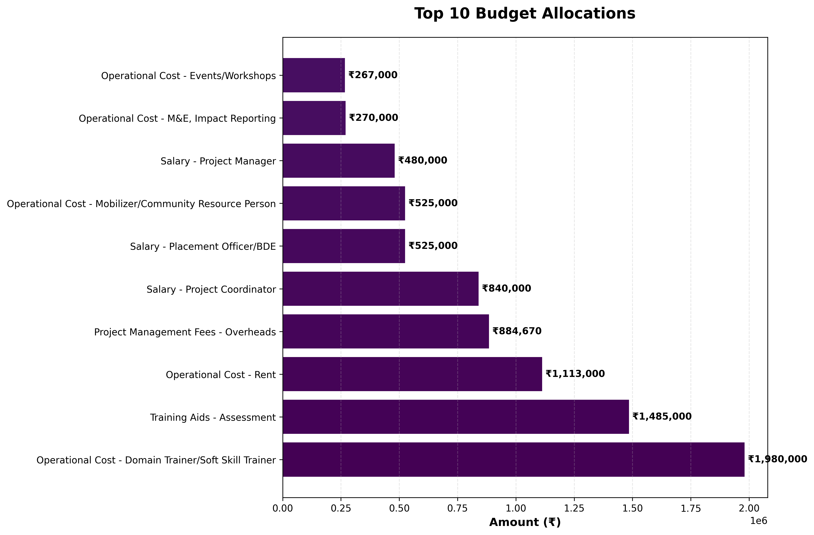

# Project Risk & Health Report

**Generated:** November 20, 2025 at 01:27 PM

---

## Project Overview

**Skilling Program for Youth in IT-ITeS Sector**

A college-cum-community-based training program for 1,980 underserved youth in Hyderabad, Mumbai, and Bangalore. The program will be implemented through 9 colleges and 3 Express Training Centres (ETCs), delivering training in AI Productivity & Applications, followed by certification and placement support.

| **Field** | **Details** |
|-----------|-------------|
| **Funder** | Ivanti Technology India Pvt. Ltd. |
| **Implementing Entity** | Sambhav Foundation |
| **Deployment Region** | Mumbai, Bangalore & Hyderabad |
| **Project Period** | 1st September 2025 to 31st March 2026 |
| **Total Budget** | ₹9,908,303.60 |
| **Duration** | 12 months |

## Executive Dashboard

### Key Metrics at a Glance

| **Metric** | **Value** |
|------------|----------|
| Total Project Value | ₹9,908,303.60 |
| Project Duration | 12 months |
| Average Monthly Burn Rate | ₹825,691.97 |
| Highest Cost Item | Operational Cost - Domain Trainer/Soft Skill Train... (₹1,980,000) |
| **Total Risks Identified** | **4** |
| High Severity Risks | 3 |
| Medium Severity Risks | 1 |

---

## Financial Health Analysis

### Cash Flow Analysis

The cash flow graph below shows the cumulative funding availability versus planned spending:

### Monthly Cash Flow Details

| **Month** | **Monthly Spend** | **Cumulative Spend** | **Cumulative Funding** | **Cash Available** |
|-----------|------------------:|---------------------:|-----------------------:|-------------------:|
| Sep-25 | ₹981,792 | ₹981,792 | ₹3,467,906 | ✅ ₹2,486,114 |
| Oct-25 | ₹1,617,504 | ₹2,599,296 | ₹3,467,906 | ✅ ₹868,610 |
| Nov 25 | ₹1,472,184 | ₹4,071,480 | ₹6,935,812 | ✅ ₹2,864,332 |
| Dec-25 | ₹1,483,104 | ₹5,554,584 | ₹6,935,812 | ✅ ₹1,381,228 |
| Jan-26 | ₹1,512,504 | ₹7,067,088 | ₹9,908,304 | ✅ ₹2,841,216 |
| Feb-26 | ₹1,304,184 | ₹8,371,272 | ₹9,908,304 | ✅ ₹1,537,032 |
| Mar-26 | ₹1,537,032 | ₹9,908,304 | ₹9,908,304 | ⚠️ ₹-0 |

### Monthly Spending Pattern

### Budget Allocation by Category

### Top Budget Line Items

## Project Timeline & Milestones

The Gantt chart below illustrates major activities and their timelines:

## Risk Register

### Risk Distribution Overview

<table>
<tr>
<td width="50%">

</td>
<td width="50%">

</td>
</tr>
</table>

---

### Detailed Risk Analysis

| **Risk Type** | **Severity** | **Details** |
|---------------|--------------|-------------|
| Cash Flow Deficit | High | **Month:** Mar-26 Planned spending (₹9,908,304.00) exceeds available funding (₹9,908,303.60) by ₹0.40 |
| activity_budget_discrepancy | high | The project narrative mentions 'Training of Trainers (ToT)' as a key deliverable, but the budget shows no allocation for ToT training. The budget includes 'Operational Cost - SME/Experts/TOT: ₹30,000.00', which is minimal and likely insufficient for a program targeting 1,980 candidates across 9 colleges and 3 ETCs. This is a major activity with a very low budget allocation. |
| timeline_discrepancy | medium | The project timeline spans from September 2025 to March 2026 (6 months). However, the budget allocations are for a full year (2025-2026), which suggests the project is funded for a longer period than the timeline indicates. This mismatch could indicate that the project is not aligned with the actual funding timeline. |
| compliance_gap | high | The project narrative states that there will be '3-month post-placement tracking of placed candidates'. However, the budget does not include any allocation for post-placement tracking beyond the initial placement. The 'Operational Cost - Candidate/Wage Tracking: ₹148,500.00' is likely insufficient for a 3-month tracking period for 990 candidates, which could lead to compliance issues with the project's own reporting requirements. |

## Strategic AI Analysis

AI-powered strategic risk audit identified the following high-level concerns:

*No strategic risks identified in this analysis.*

---

## Recommendations & Next Steps

Based on the analysis above:

1. **Immediate Action Required:** Review all High severity risks and develop mitigation strategies
2. **Financial Monitoring:** Track actual spending against planned budget monthly
3. **Risk Mitigation:** Address activity-budget mapping gaps identified
4. **Compliance:** Ensure post-placement tracking mechanisms are in place

---

## 📂 Data Sources Analyzed

### Primary Project Files

| **File Type** | **Filename** | **Status** |
|---------------|--------------|------------|
| UC/Budget | `Ivanti UC.xlsx` | ✓ Found |
| Activity/Plan | `Ivanti activity sheet_v2.xlsx` | ✓ Found |
| Billing/Tracker | `Ivanti billing & collections tracker.xlsx` | ✓ Found |

### Additional Context Files

- `project_metadata.txt`
- `smart_filtered_metadata.txt`

---

## Report Metadata

**Report Generated:** November 20, 2025 at 01:27 PM
**Analysis Engine:** Risk Analyzer v2.0
**AI Model:** Ollama qwen3:4b (local)

---

*End of Report*
